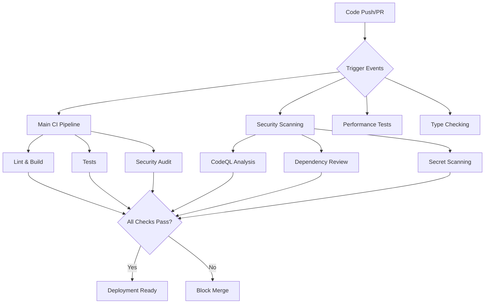

# CI/CD Guide - SatyaCoaching Platform

## Overview

This guide provides comprehensive documentation for the Continuous Integration and Continuous Deployment (CI/CD) processes implemented in the SatyaCoaching platform.

## 🏗️ Pipeline Architecture

Our CI/CD system consists of multiple specialized workflows designed for different purposes:



## 📋 Workflow Documentation

### 1. Main CI Pipeline (`ci.yml`)

**Purpose**: Primary pipeline for code quality, testing, and basic security
**Triggers**: 
- Push to `main` branch
- Pull requests to `main` branch

**Jobs Overview**:

#### **Lint Job**
- **Runtime**: ~2-3 minutes
- **Purpose**: Code style and quality enforcement
- **Tools**: ESLint with security rules
- **Scope**: Client, Server, Root workspaces
- **Blocking**: Yes - critical errors fail the build

#### **Build Job**
- **Runtime**: ~3-5 minutes  
- **Purpose**: Compilation and build verification
- **Dependencies**: Requires `lint` job success
- **Scope**: All workspaces
- **Artifacts**: Build outputs cached for other jobs

#### **Security Audit Job**
- **Runtime**: ~1-2 minutes
- **Purpose**: Production dependency vulnerability scanning
- **Dependencies**: Requires `lint` job success
- **Tools**: npm audit (moderate+ severity threshold)
- **Scope**: Root, Server, Client packages
- **Blocking**: Yes - moderate+ vulnerabilities fail the build

#### **Test Job**
- **Runtime**: ~5-10 minutes
- **Purpose**: Unit and integration testing
- **Dependencies**: Requires `build` job success
- **Coverage**: Jest test suites
- **Reports**: Test results and coverage metrics

### 2. Security Scanning Pipeline (`security.yml`)

**Purpose**: Comprehensive security analysis and vulnerability detection
**Triggers**:
- Push to `main` branch
- Pull requests to `main` branch  
- Daily scheduled runs (2 AM UTC)

**Jobs Overview**:

#### **CodeQL Analysis**
- **Runtime**: ~15-20 minutes
- **Purpose**: Static code analysis for security vulnerabilities
- **Languages**: JavaScript, TypeScript
- **Queries**: Security-extended + Quality rules
- **Integration**: GitHub Security tab

#### **Dependency Review**
- **Runtime**: ~2-3 minutes
- **Purpose**: PR-based dependency change analysis
- **Trigger**: Pull requests only
- **Output**: Automated PR comments for new vulnerabilities

#### **Advanced Security Scanning**
- **Runtime**: ~3-5 minutes
- **Purpose**: Comprehensive vulnerability assessment
- **Tools**: Enhanced npm audit with JSON reporting
- **Artifacts**: Detailed security reports

#### **Secret Scanning**
- **Runtime**: ~1-2 minutes
- **Purpose**: Detection of hardcoded secrets
- **Patterns**: API keys, JWT secrets, database URLs, certificates
- **Scope**: All source files

#### **License Compliance**
- **Runtime**: ~1-2 minutes
- **Purpose**: Open source license verification
- **Tools**: License checker with allowlist
- **Blocking**: Restrictive licenses fail the build

### 3. Performance Testing (`performance.yml`)

**Purpose**: Performance regression detection and monitoring
**Triggers**: 
- Push to `main` branch
- Pull requests to `main` branch

**Components**:
- Build performance metrics
- Bundle size analysis
- Performance budgets enforcement

### 4. Type Checking (`typecheck.yml`)

**Purpose**: TypeScript type safety verification
**Triggers**:
- Push to `main` branch  
- Pull requests to `main` branch

**Scope**: Full TypeScript compilation check across all workspaces

## 🔒 Security Integration

### Security Gates

Our CI/CD pipeline implements multiple security gates that must pass before code can be merged:

1. **ESLint Security Rules**: Static analysis for common security antipatterns
2. **npm audit**: Production dependency vulnerability scanning
3. **CodeQL**: Advanced SAST (Static Application Security Testing)
4. **Secret Detection**: Prevention of credential leaks
5. **License Compliance**: Legal risk mitigation

### Severity Thresholds

| Tool | Blocking Threshold | Action |
|------|-------------------|--------|
| npm audit | Moderate+ | Fail CI |
| ESLint | Error level | Fail CI |
| CodeQL | High+ | GitHub Security Alert |
| Secret Scan | Any detection | Fail CI |
| License Check | Restrictive licenses | Fail CI |

### Security Reporting

- **GitHub Security Tab**: CodeQL findings
- **PR Comments**: Dependency review results
- **Artifacts**: Detailed audit reports in JSON format
- **Daily Reports**: Scheduled security scans

## 🚀 Development Workflow

### For Developers

1. **Local Development**:
   ```bash
   # Run security checks locally
   npm audit --audit-level moderate
   npm run lint
   npm run type-check
   npm test
   ```

2. **Pre-commit Checklist**:
   - [ ] All tests passing locally
   - [ ] No ESLint errors
   - [ ] No TypeScript errors  
   - [ ] Security audit clean
   - [ ] No hardcoded secrets

3. **Pull Request Process**:
   - All CI checks must pass
   - Security scans reviewed
   - Code review approval required
   - Automated dependency review

### For Maintainers

1. **Merge Requirements**:
   - All status checks passing
   - No security vulnerabilities introduced
   - Performance budgets maintained
   - Documentation updated if needed

2. **Security Response**:
   - Monitor GitHub Security tab daily
   - Review dependency alerts promptly
   - Update vulnerable packages within 48 hours
   - Document security decisions

## 📊 Monitoring & Maintenance

### CI/CD Health Monitoring

**Key Metrics**:
- Build success rate (target: >95%)
- Average build time (target: <15 minutes)
- Security scan coverage (target: 100%)
- False positive rate (target: <5%)

**Weekly Reviews**:
- Pipeline performance analysis
- Security finding triage
- Dependency update planning
- Documentation updates

### Troubleshooting Common Issues

#### **Build Failures**

```bash
# Lint failures
npm run lint:fix

# Type errors  
npm run type-check

# Test failures
npm test -- --verbose

# Security audit failures
npm audit fix
```

#### **Security Scan Issues**

```bash
# Check specific vulnerabilities
npm audit --json

# Update specific package
npm update package-name

# Override non-critical findings (use sparingly)
npm audit --audit-level high
```

#### **Performance Issues**

```bash
# Analyze bundle size
npm run build:analyze

# Check performance budgets
npm run performance:check
```

## 🔧 Configuration Files

### Key Configuration Files

| File | Purpose | Location |
|------|---------|----------|
| `.github/workflows/ci.yml` | Main CI pipeline | Root |
| `.github/workflows/security.yml` | Security scanning | Root |
| `.eslintrc.js` | Linting rules | Root |
| `tsconfig.json` | TypeScript config | Each workspace |
| `package.json` | Dependencies & scripts | Each workspace |

### Environment Variables

| Variable | Purpose | Required |
|----------|---------|----------|
| `ANTHROPIC_API_KEY` | AI services | Yes |
| `SNYK_TOKEN` | Advanced security scanning | Optional |
| `GITHUB_TOKEN` | CI/CD operations | Auto-provided |

## 📈 Continuous Improvement

### Planned Enhancements

1. **Advanced Security**:
   - Container scanning for Docker deployments
   - Infrastructure as Code security
   - Runtime security monitoring

2. **Performance**:
   - Visual regression testing
   - Real user monitoring integration
   - Automated performance optimization

3. **Quality**:
   - Mutation testing
   - Contract testing for APIs
   - End-to-end test automation

### Feedback & Contributions

For CI/CD improvements:
1. Open an issue with the `ci/cd` label
2. Propose changes via pull request
3. Document configuration changes
4. Update this guide with new processes

---

## 📚 Related Documentation

- **[CI Security Documentation](ci-security.md)** - Detailed security scanning processes
- **[Performance Budgets](performance-budgets.md)** - Performance monitoring setup
- **[Contributing Guidelines](../.github/PULL_REQUEST_TEMPLATE.md)** - Development workflow

---

*Last updated: January 2025*
*Version: 1.0.0* 