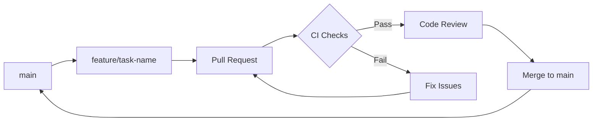

# Development Workflow Guide - SatyaCoaching Platform

## Overview

This guide outlines the development workflow, best practices, and processes for contributing to the SatyaCoaching platform. It ensures consistent code quality, security, and maintainability across the project.

## 🚀 Getting Started

### Prerequisites

- **Node.js**: v20.x or higher
- **npm**: v10.x or higher  
- **Git**: Latest version
- **Code Editor**: VS Code recommended with extensions

### Initial Setup

```bash
# Clone the repository
git clone <repository-url>
cd SatyaCoaching

# Install dependencies for all workspaces
npm install

# Set up environment variables
cp client-env.example client/.env.local
cp server-env.example server/.env

# Run initial build
npm run build

# Start development servers
npm run dev
```

### Environment Configuration

#### Client Environment (`.env.local`)
```env
VITE_API_URL=http://localhost:3001
VITE_SUPABASE_URL=your_supabase_url
VITE_SUPABASE_ANON_KEY=your_supabase_key
```

#### Server Environment (`.env`)
```env
PORT=3001
DATABASE_URL=your_database_url
ANTHROPIC_API_KEY=your_anthropic_key
JWT_SECRET=your_jwt_secret
```

## 🔄 Development Workflow

### Branch Strategy

We use a **GitHub Flow** strategy with protection rules:



#### Branch Naming Convention

- **Features**: `feature/description` or `feature/task-id-description`
- **Bug fixes**: `fix/description` or `fix/bug-id-description`  
- **Hotfixes**: `hotfix/critical-issue`
- **Documentation**: `docs/description`

### Local Development Process

#### 1. **Create Feature Branch**
```bash
# Start from main branch
git checkout main
git pull origin main

# Create and switch to feature branch
git checkout -b feature/user-authentication

# OR using Task Master integration
git checkout -b feature/task-15-user-auth
```

#### 2. **Local Development Loop**
```bash
# Start development servers
npm run dev

# In separate terminals:
# - Client: http://localhost:8080
# - Server: http://localhost:3001
# - Database: Local or remote
```

#### 3. **Pre-commit Validation**

Run the full validation suite before committing:

```bash
# Quick validation (runs in ~30 seconds)
npm run pre-commit

# Full validation (runs in ~2-3 minutes)
npm run validate-all
```

**Pre-commit Script Includes**:
- **Linting**: ESLint with security rules
- **Type checking**: TypeScript compilation
- **Testing**: Unit and integration tests
- **Security audit**: npm audit with moderate threshold
- **Build verification**: Ensure code compiles

#### 4. **Commit Standards**

We follow **Conventional Commits** specification:

```bash
# Format: type(scope): description
git commit -m "feat(auth): implement JWT token validation"
git commit -m "fix(api): resolve CORS headers issue"
git commit -m "docs(ci): update security scanning guide"
```

**Commit Types**:
- `feat`: New features
- `fix`: Bug fixes
- `docs`: Documentation changes
- `style`: Code style changes (formatting, etc.)
- `refactor`: Code refactoring without functional changes
- `test`: Adding or updating tests
- `chore`: Maintenance tasks
- `security`: Security-related changes

### Testing Strategy

#### Test Types and Coverage

| Test Type | Location | Purpose | Target Coverage |
|-----------|----------|---------|-----------------|
| **Unit Tests** | `src/__tests__/` | Individual functions/components | 80%+ |
| **Integration Tests** | `src/__tests__/` | Component interactions | 70%+ |
| **API Tests** | `server/src/__tests__/` | Endpoint testing | 90%+ |
| **E2E Tests** | `client/tests/` | User workflow testing | Key user paths |

#### Running Tests

```bash
# Run all tests
npm test

# Run tests with coverage
npm run test:coverage

# Run tests in watch mode (development)
npm run test:watch

# Run specific test file
npm test -- SessionModal.test.tsx

# Run tests for specific workspace
cd client && npm test
cd server && npm test
```

#### Test Best Practices

1. **Test Structure**: Follow AAA pattern (Arrange, Act, Assert)
2. **Descriptive Names**: `should create session when valid data provided`
3. **Mock External Dependencies**: API calls, database connections
4. **Test Edge Cases**: Error conditions, boundary values
5. **Keep Tests Independent**: Each test should run in isolation

### Code Quality Standards

#### ESLint Configuration

Our ESLint setup includes:
- **Security Rules**: Detecting security vulnerabilities
- **TypeScript Rules**: Type-safe coding practices
- **React Rules**: Component best practices
- **Import Rules**: Clean import organization

#### TypeScript Standards

- **Strict Mode**: Enabled across all workspaces
- **Type Definitions**: All functions have explicit return types
- **Interface Usage**: Prefer interfaces over types for object shapes
- **Generic Usage**: Use generics for reusable components

#### Code Style Guidelines

```typescript
// ✅ Good: Explicit types and error handling
interface UserSessionData {
  userId: string;
  sessionToken: string;
  expiresAt: Date;
}

const createUserSession = async (userData: UserSessionData): Promise<Session> => {
  try {
    const session = await sessionService.create(userData);
    return session;
  } catch (error) {
    logger.error('Failed to create user session:', error);
    throw new SessionCreationError('Unable to create session');
  }
};

// ❌ Avoid: Implicit types and poor error handling
const createUserSession = async (userData) => {
  const session = await sessionService.create(userData);
  return session;
};
```

## 🔒 Security Requirements

### Security Checklist

Before submitting any code:

- [ ] **No hardcoded secrets** (API keys, passwords, tokens)
- [ ] **Input validation** on all user inputs
- [ ] **SQL injection prevention** (parameterized queries)
- [ ] **XSS prevention** (sanitized outputs)
- [ ] **Authentication checks** on protected routes
- [ ] **CORS configuration** properly set
- [ ] **Error messages** don't leak sensitive information

### Security Scanning

```bash
# Run local security audit
npm audit --audit-level moderate

# Check for secrets (manual review)
grep -r "api_key\|password\|secret" src/ --exclude-dir=node_modules

# Run dependency vulnerability check
npm run security:check
```

### Sensitive Data Handling

```typescript
// ✅ Good: Environment variables for secrets
const apiKey = process.env.ANTHROPIC_API_KEY;

// ✅ Good: Parameterized queries
const user = await db.query('SELECT * FROM users WHERE id = ?', [userId]);

// ❌ Avoid: Hardcoded secrets
const apiKey = 'sk-ant-api03-xyz123'; // Never do this

// ❌ Avoid: String concatenation in SQL
const user = await db.query(`SELECT * FROM users WHERE id = ${userId}`);
```

## 📝 Pull Request Process

### PR Preparation

1. **Update Documentation**: If your changes affect user-facing features or APIs
2. **Add Tests**: For new features or bug fixes
3. **Run Full Validation**: `npm run validate-all`
4. **Update Changelogs**: For significant changes

### PR Template

Our PR template includes:

- **Description**: What changes were made and why
- **Type of Change**: Feature/Bug fix/Documentation/etc.
- **Testing**: How the changes were tested
- **Security**: Security implications and mitigations
- **Dependencies**: Any new dependencies added
- **Checklist**: Pre-flight checks completed

### Review Process

#### For Authors

1. **Self-Review**: Review your own PR first
2. **CI Checks**: Ensure all automated checks pass
3. **Address Feedback**: Respond to review comments promptly
4. **Keep PRs Small**: Aim for <500 lines of changes
5. **Descriptive Commits**: Clear commit messages

#### For Reviewers

1. **Security Focus**: Look for security implications
2. **Code Quality**: Ensure code follows standards
3. **Test Coverage**: Verify adequate testing
4. **Performance**: Consider performance implications
5. **Documentation**: Check if docs need updates

### CI/CD Integration

All PRs must pass:

- ✅ **Lint Checks**: ESLint with security rules
- ✅ **Type Checks**: TypeScript compilation
- ✅ **Tests**: Unit and integration tests
- ✅ **Security Audit**: npm audit (moderate+ threshold)
- ✅ **Build**: Successful compilation
- ✅ **Security Scan**: CodeQL analysis

## 🛠️ Common Development Tasks

### Adding New Features

```bash
# 1. Create feature branch
git checkout -b feature/new-dashboard

# 2. Install any new dependencies
npm install new-package

# 3. Implement feature with tests
# - Write tests first (TDD approach)
# - Implement feature
# - Ensure tests pass

# 4. Update documentation
# - Update API docs if needed
# - Update user documentation
# - Update component documentation

# 5. Run validation
npm run validate-all

# 6. Commit and push
git add .
git commit -m "feat(dashboard): add analytics dashboard component"
git push origin feature/new-dashboard
```

### Bug Fix Process

```bash
# 1. Reproduce the bug locally
# 2. Write a failing test that demonstrates the bug
# 3. Fix the issue
# 4. Ensure the test now passes
# 5. Run full test suite
# 6. Submit PR with clear description
```

### Dependency Management

```bash
# Check for outdated packages
npm outdated

# Update packages (be cautious with major versions)
npm update

# Add new dependency
npm install --save new-package

# Add dev dependency
npm install --save-dev new-dev-package

# Remove unused dependency
npm uninstall old-package
```

## 🚨 Troubleshooting

### Common Issues

#### **Build Failures**
```bash
# Clear all caches
rm -rf node_modules package-lock.json
npm install

# Clear Next.js cache (if applicable)
rm -rf .next

# Rebuild everything
npm run build
```

#### **Test Failures**
```bash
# Run tests in verbose mode
npm test -- --verbose

# Run specific test file
npm test -- SessionModal.test.tsx

# Clear test cache
npm test -- --clearCache
```

#### **Type Errors**
```bash
# Run type check
npm run type-check

# Check specific file
npx tsc --noEmit src/components/Component.tsx
```

#### **Security Audit Issues**
```bash
# Check vulnerability details
npm audit --json

# Fix automatically (when possible)
npm audit fix

# Update specific vulnerable package
npm install package-name@latest
```

### Getting Help

1. **Documentation**: Check existing docs first
2. **GitHub Issues**: Search for similar issues
3. **Team Chat**: Ask in development channel
4. **Code Reviews**: Request early feedback on complex changes

## 📊 Performance Considerations

### Development Performance

- **Hot Reload**: Vite provides fast hot reload for client development
- **Build Caching**: Aggressive caching for node_modules and build outputs
- **Parallel Processing**: Tests and builds run in parallel where possible

### Production Performance

- **Bundle Analysis**: Regular bundle size monitoring
- **Performance Budgets**: Enforced in CI/CD pipeline
- **Code Splitting**: Implement lazy loading for large components
- **Asset Optimization**: Images and static assets optimized

## 📈 Continuous Improvement

### Code Quality Metrics

We track:
- **Test Coverage**: Aim for 80%+ overall coverage
- **Type Safety**: 100% TypeScript coverage
- **Security Score**: Zero high-severity vulnerabilities
- **Performance Score**: Lighthouse scores >90

### Regular Maintenance

**Weekly**:
- Dependency security updates
- CI/CD pipeline health check
- Performance metrics review

**Monthly**:
- Major dependency updates
- Code quality review
- Documentation updates
- Security audit review

---

## 📚 Related Documentation

- **[CI/CD Guide](ci-cd-guide.md)** - Complete CI/CD pipeline documentation
- **[CI Security Documentation](ci-security.md)** - Security scanning processes  
- **[Performance Budgets](performance-budgets.md)** - Performance monitoring

---

*Last updated: January 2025*
*Version: 1.0.0* 